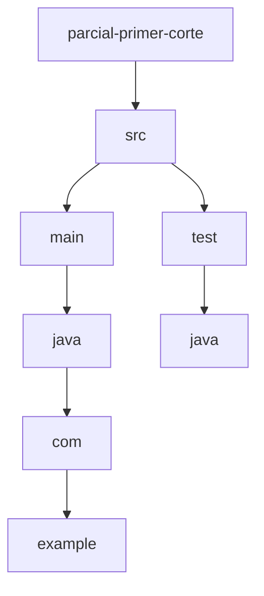
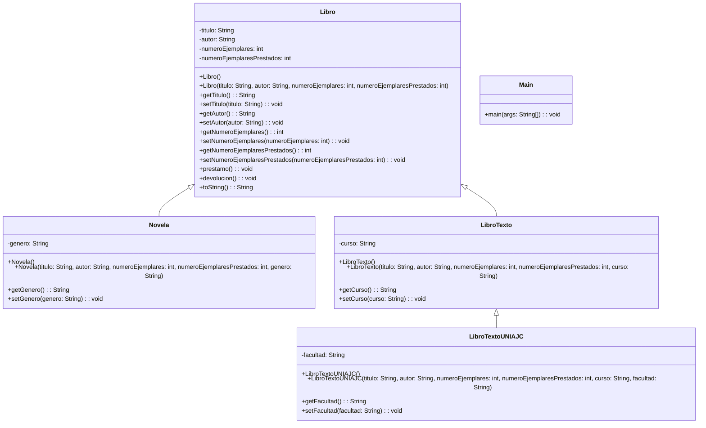

# parcial-primer-corte
Parcial de programación del primer corte

## Estructura del Proyecto

```
parcial-primer-corte/
├── .gitignore
├── pom.xml
├── README.md
└── src/
    ├── main/
    │   └── java/
    │       └── com/
    │           └── example/
    │               ├── Libro.java
    │               ├── LibroTexto.java
    │               ├── LibroTextoUNIAJC.java
    │               ├── Main.java
    │               └── Novela.java
    └── test/
        └── java/
```

## Diagrama UML

### Diagrama de Paquetes


### Diagrama de Clases

